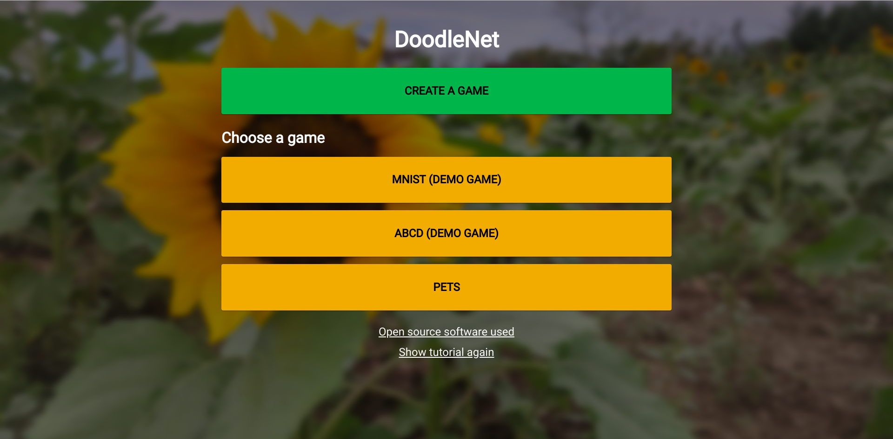
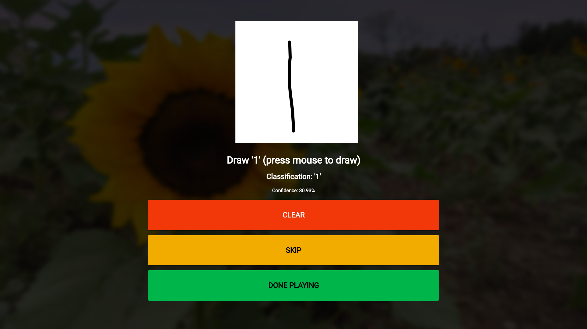

## DoodleNet

This application is designed to demonstrate the power of machine learning and computer vision using game mechanics. This application shows people the process of getting a machine learning model set up, as they have to train on different classes and will get the feel for how much training is needed for a simple drawing based application. They will then be able to play the games, which could also be used as a learning tool for people (especially kids) learning how to write letters or numbers. To make this app possible, innovations such as TensorFlow.js, TrackingJS, and FireBase were needed for the machine learning, computer vision, and persistence aspects respectively. This application addresses the problem as it allows users to see machine learning and computer vision in action, in a way that they get to actively participate with. As mentioned earlier, this project has the potential to help people learn to draw unfamiliar characters, given enough training data to the networks. To do this more effectively, it may need to be tweaked to not accept the answer in real time, as sometimes the network is sure you are drawing a specific symbol even if it is not finished.

The homescreen.

Playing the game.
